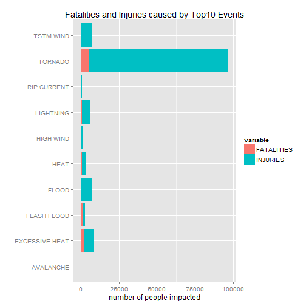
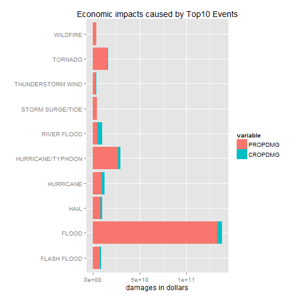

# An analysis of the fatalities and economic impacts caused from different events #
========================================================

## Synopsis: ##

This report is about a brief research about the impacts to people's safety and economy. 
Based on the dataset downloaded from **NOAA Storm Database**(URL: [https://d396qusza40orc.cloudfront.net/repdata%2Fdata%2FStormData.csv.bz2], 902297 obs. of 37 variables ), we took a glimpse at the cases corresponding to each event types (**EVTYPE**).
After we made two plots, we drew to the conclusion that most fatal & economical impact is caused by tornados. 
According to the first plot, most fatal impact of harmful events come from tornados, which causes approx. 100,000 people died in the last 60 years.
According to the second plot, most economic impact come from floodes, about $15 billions dmg1 for 60 years.

## Prerequisites ##

#### Load the packages necessary for analysis ####

We will use **reshape**, **ggplot2**, **Hmisc**, **car** packages to accomplish our data analysis.
And use **knitr** package to generate this report.


```r
library(knitr)
library(reshape)
library(ggplot2)
library(Hmisc)
```

```
## Loading required package: grid
## Loading required package: lattice
## Loading required package: survival
## Loading required package: splines
## Loading required package: Formula
## 
## Attaching package: 'Hmisc'
## 
## 下列对象被屏蔽了from 'package:base':
## 
##     format.pval, round.POSIXt, trunc.POSIXt, units
```

```r
library(car)
```

## Data Processing ##

### Load Data ###

I tried loading data from the original dataset as follows


```r
setwd("E:/Rdir/repdata2")
storm_csv <- read.csv("repdata_data_StormData.csv.bz2", header = TRUE, nrows=902297, comment.char="")
```

```
## Warning: EOF within quoted string
```

```r
dim(storm_csv) ##not 902297 obs.
```

```
## [1] 692288     37
```
But as you can see, I failed loading the data from the original csv. Struggled for 4 hours to solve the problem, I finally find that the error is because of the settings of my operating system, which seems a difficult task to deal with.


```r
sessionInfo()
```

```
## R version 3.1.0 (2014-04-10)
## Platform: x86_64-w64-mingw32/x64 (64-bit)
## 
## locale:
## [1] LC_COLLATE=Chinese (Simplified)_China.936 
## [2] LC_CTYPE=Chinese (Simplified)_China.936   
## [3] LC_MONETARY=Chinese (Simplified)_China.936
## [4] LC_NUMERIC=C                              
## [5] LC_TIME=Chinese (Simplified)_China.936    
## 
## attached base packages:
## [1] splines   grid      stats     graphics  grDevices utils     datasets 
## [8] methods   base     
## 
## other attached packages:
## [1] car_2.0-20      Hmisc_3.14-4    Formula_1.1-1   survival_2.37-7
## [5] lattice_0.20-29 ggplot2_1.0.0   reshape_0.8.5   knitr_1.6      
## 
## loaded via a namespace (and not attached):
##  [1] cluster_1.15.2      colorspace_1.2-4    digest_0.6.4       
##  [4] evaluate_0.5.5      formatR_0.10        gtable_0.1.2       
##  [7] latticeExtra_0.6-26 MASS_7.3-31         munsell_0.4.2      
## [10] nnet_7.3-8          plyr_1.8.1          proto_0.3-10       
## [13] RColorBrewer_1.0-5  Rcpp_0.11.1         reshape2_1.4       
## [16] scales_0.2.4        stringr_0.6.2       tools_3.1.0
```

I asked for help in the discussion forum, somebody in the forum offers me kindly help by sharing me an .RData file containing the raw dataset after we find no ways to deal with the problem that prevents me to start the mini-project. 
The original thread contains the .RData file is [https://class.coursera.org/repdata-003/forum/thread?thread_id=31]
The download link: [https://dl.dropboxusercontent.com/u/31729865/mydata3.Rda]
I modified this .Rdata file in the console, changed the name of the dataset into "storm"(from "mydata")  
**I certify that the .RData file only contains the raw data set.**

So the process of loading the data **for me** is like that:


```r
load("./storm.Rdata")
dim(storm)
```

```
## [1] 902297     37
```

### Data Process ###

**STEP1:**Turn the event type (**EVTYPE**) into upper case in order to lessen the possibility of error when categorizing the cases.

```r
storm$EVTYPE <- toupper(storm$EVTYPE)
```

**STEP2:**Sum the fatalities and injuries (Safety Issues) by different event types, then transform it into a shape that's easy to process .

```r
dmg1 <- aggregate(cbind(FATALITIES,INJURIES) ~ EVTYPE ,  storm,  sum)
dmg2 <- melt(head(dmg1[order(-dmg1$FATALITIES, -dmg1$INJURIES), ], 10))
```

```
## Using EVTYPE as id variables
```

**STEP3:**Multiply the damage of properties by the magnitute.

```r
storm$PROPDMG <- storm$PROPDMG * as.numeric(Recode(storm$PROPDMGEXP, "'0'=1;'1'=10;'2'=100;'3'=1000;'4'=10000;'5'=100000;'6'=1000000;'7'=10000000;'8'=100000000;'B'=1000000000;'h'=100;'H'=100;'K'=1000;'m'=1000000;'M'=1000000;'-'=0;'?'=0;'+'=0",as.factor.result=FALSE))
storm$CROPDMG <- storm$CROPDMG * as.numeric(Recode(storm$CROPDMGEXP, "'0'=1;'2'=100;'B'=1000000000;'k'=1000;'K'=1000;'m'=1000000;'M'=1000000;''=0;'?'=0",as.factor.result=FALSE))
```
**STEP4:**Sum the economic damages by different event types, then transform it into a shape that's easy to process.

```r
eco1 <- aggregate(cbind(PROPDMG,CROPDMG) ~ EVTYPE ,  storm,  sum)
eco2 <- melt(head(eco1[order(-eco1$PROPDMG, -eco1$CROPDMG), ], 10))
```

```
## Using EVTYPE as id variables
```

## Results ##

### Fatal Impacts ###

##### Across the United States, which types of events (as indicated in the EVTYPE variable) are most harmful with respect to population health? #####

We made a plot indicates the casualities and injuries by event types, using ggplot2 package. 
We draw to a conclusion that **TORNADO CONTRIBUTES MOST** in the fatalities and injuries.


```r
ggplot(dmg2,  aes(x=EVTYPE, y=value, fill=variable),color = variable) + geom_bar(stat = "identity") + 
        ggtitle("Fatalities and Injuries caused by Top10 Events") + labs(x = "",  y="number of people impacted") + coord_flip() 
```

 

### Economical Impacts ###

##### Across the United States, which types of events have the greatest economic consequences? #####

We made a plot indicates the economic impacts in dollars by event types, using ggplot2 package. 
We draw to a conclusion that **FLOOD CONTRIBUTES MOST** in the economic impacts.


```r
ggplot(eco2,  aes(x = EVTYPE, y = value, fill = variable), color = variable) + geom_bar(stat = "identity") +ggtitle("Economic impacts caused by Top10 Events") + labs(x = "",  y="damages in dollars") + coord_flip() 
```

 
